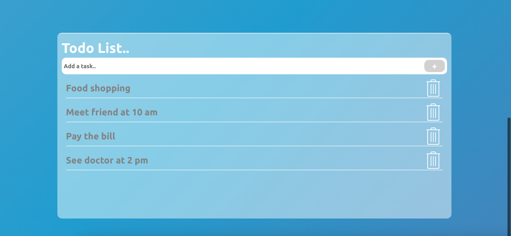

# Geolocation

This project is a front-end project was built in REACT with mobile-first design.

[Live Demo](https://react-geolocation-project-01.web.app/)

### `Feature`

The project was deployed on Firebase with Github action used.

The first page of the project has a log in authentication which stored the allowed account on Firebase Authentication.
Only authorized users can have access to log in.

After logging in, the next page displays the weather forecast data from [weatherapi.com](https://www.weatherapi.com/) RESTful API regarding the user's geolocation.

Users can view real-time weather forecast in their own areas and also can search for another location in the world.
The project has function to show forecast by hour, air quality, chance of rain, wind, humidity, sunrise and sunset.

It also displays the 7-day forecast with the maximum and minimum temperatures.

Finally, this project turns into a litter helper for the user in the morning to shows them a todo list for the day.
